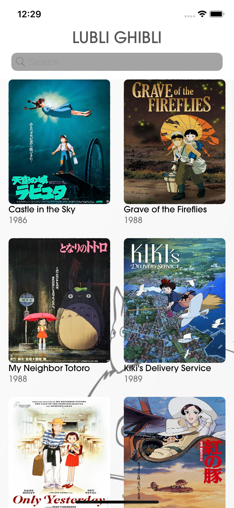
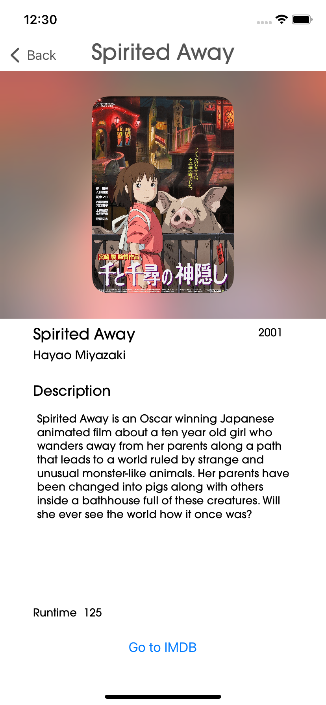

<h1 align="center">

Lubli Ghibli

</h1>

## Objective
To half programmatically create an iOS app using the data provided from the [Studio Ghibli API](https://ghibliapi.herokuapp.com/) and to render results in a collectionView. Inspiration and images courtesy of https://github.com/kxvn-lx/Ghibliii

## Progress
- Data now fetched from hardcoded JSON, API call made using Nuke for image loading.
- CollectionView now working and displaying film data cards
- General layout of each film card now completed
- IMDB links now operational in safari
- Background Blur effect added for film images
- Swipe right gesture now added to return to collectionView

## Improvements
- Layout constraints

## Installation
- Clone repository

## Screenshots

## Demo

## Tech Stack
Swift, UIKit

## Dependencies
- Nuke
- SafariServices

## Simulator Version
11

## Collaborators
@mattybwoy
